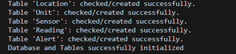

# Sensor_Database_Automation

## Project Overview
This project automates the creation and initialization of a relational database for IoT sensors using **Python** and **MariaDB**. 

### Key Features:
* **Automated DDL Deployment**: Python script that handles database creation and table initialization.
* **Referential Integrity**: Implemented FOREIGN KEY constraints with ON DELETE CASCADE to ensure data consistency.
* **Optimized Schema**: Used INT UNSIGNED for primary keys and ENGINE=InnoDB for ACID compliance.
* **Error Handling**: Robust try-except blocks to handle MariaDB errno 150 and syntax conflicts.

